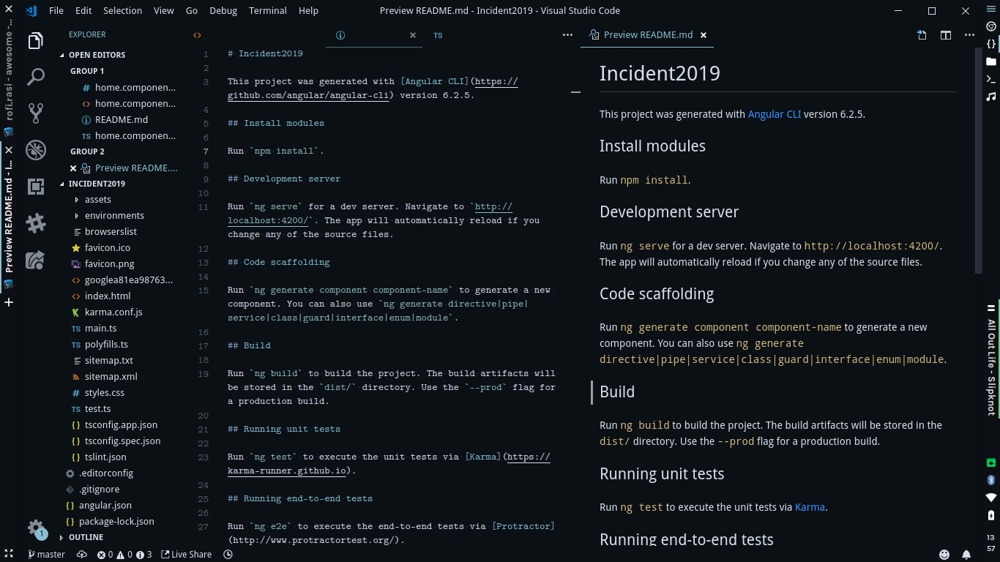
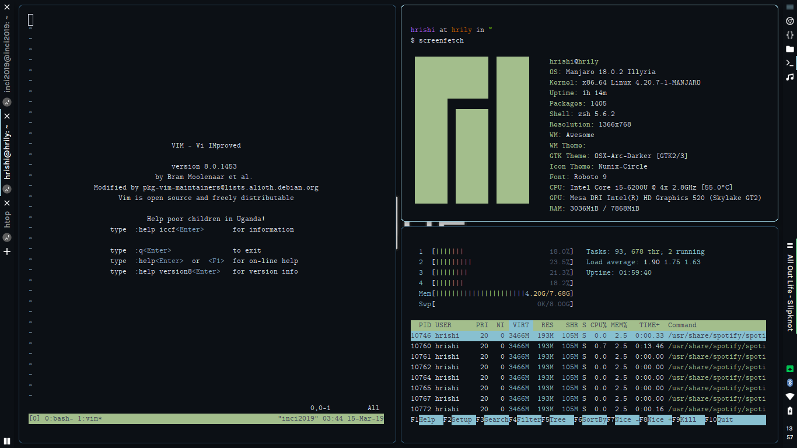
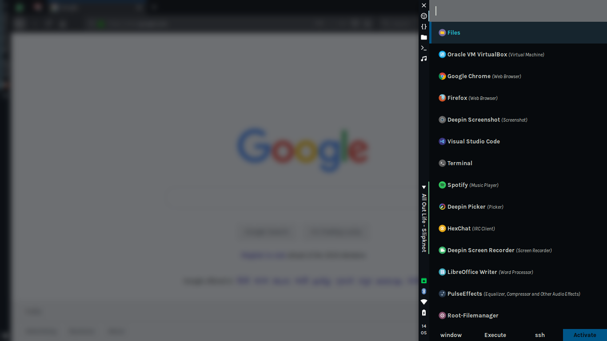
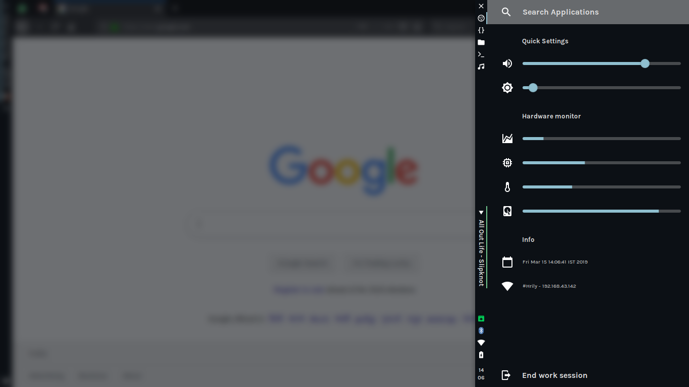

# My ricing for AwesomeWm 4.2

Based on Nord color scheme


| Editor        | Terminal      |
|:-------------:|:-------------:|
|||

| Rofi          | Panel         |
|:-------------:|:-------------:|
|||

## Requirements
- [AwesomeWM](https://awesomewm.org/) as the window manager
- [Karla](https://fonts.google.com/specimen/Karla) and [CMU Typewriter](https://fontlibrary.org/en/font/cmu-typewriter) as the **fonts**
- [Rofi](https://github.com/DaveDavenport/rofi) for the app launcher
- [Compton fork](https://github.com/tryone144/compton) for the compositor (blur and animations)
- (Optional) [OSX-Arc-Darker]([https://github.com/nana-4/materia-theme](https://aur.archlinux.org/packages/osx-arc-darker/)) as GTK theme
- (Optional) [Numix-Circle](https://github.com/numixproject/numix-icon-theme-circle) as icon theme

## Installation

```
git clone https://github.com/Hrily/material-awesome.git ~/.config/awesome
```
